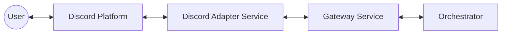

# Unified Platform Service Design

> **DEPRECATED** (2026-02-07): The Platform Adapter pattern described here was adopted and is now implemented as the Discord Service. This design doc is preserved for historical context. See `discord_service_design.md` for the current design.

**Status:** Deprecated
**Date:** 2026-01-25
**Context:** Replaces separate Ingress/Egress services for synchronous Gateway interactions.

## 1. Problem Statement

The previous architecture separated **Ingress** (receiving events) and **Egress** (sending replies). However, the **Gateway Service** exposes a synchronous, streaming API (`POST /v1/chat/internal`).

If the Ingress Service calls this API, it must hold the connection open to receive the streaming response from the Orchestrator/LLM. Consequently, the Ingress Service receives the reply content and is best positioned to send it back to the user.

Forcing the Ingress Service to ignore the response and waiting for a separate Egress Service to handle the reply introduces unnecessary complexity, latency, and synchronization issues.

## 2. Proposed Solution: Platform Adapter Pattern

We will transition to a **Platform Adapter** pattern (or "Unified Service"). Each external platform (Discord, Slack, etc.) will have a dedicated service that handles the full bidirectional communication loop.

### 2.1 Architecture



### 2.2 Data Flow (Synchronous/Streaming)

1.  **Ingress:** `Discord Adapter` receives message via WebSocket (Discord Bot API).
2.  **Process:** `Discord Adapter` normalizes event and calls `Gateway Service` (`POST /v1/chat/internal`).
3.  **Stream:** `Gateway Service` streams the response chunks back to `Discord Adapter` as they are generated by the LLM.
4.  **Egress:** `Discord Adapter` aggregates chunks (or updates a placeholder message) and sends the reply to `Discord`.

### 2.3 Multi-Platform Strategy: One Adapter per Service

We recommend a **separate microservice for each platform** (e.g., `discord-service`, `email-service`, `slack-service`).

**Rationale:**
1.  **Dependency Isolation:** Discord requires heavy WebSocket libraries (`discord.py`); Email requires IMAP/SMTP; Slack uses HTTP/Events API. Keeping them separate avoids dependency bloat and conflicts.
2.  **Failure Isolation:** A crash in the Discord connection logic should not affect Email polling.
3.  **Scaling:** Platforms have different traffic profiles. You may need 10 replicas for high-volume Discord traffic but only 1 for Email.
4.  **State Management:** Discord bots are stateful (persistent WebSocket). Webhooks are stateless. Mixing these patterns in a single service increases complexity.

## 3. Benefits

1.  **Simplicity:** Eliminates queues (Redis/PubSub) for the hot path.
2.  **Streaming Support:** Natively supports streaming LLM responses to the user (e.g., updating a Discord message in real-time).
3.  **Connection Management:** A single service manages the WebSocket connection, avoiding "split brain" issues where one service reads and another tries to write using a different connection/token.
4.  **Error Handling:** Immediate feedback to the user if the Gateway call fails.

## 4. Migration Plan

1.  **Rename:** Rename `ingress-service` to `discord-service` (or keep as `ingress-service` but expand scope).
    *   *Recommendation:* `discord-service` is more precise if we plan to have `slack-service` later.
2.  **Refactor:**
    *   Keep `GatewayClient`.
    *   Update `DiscordGatewayHandler` to handle the *response* from `GatewayClient`.
    *   Implement "reply" logic within the handler.
3.  **Egress Service:**
    *   The `egress-service` may still be needed for *asynchronous/unsolicited* messages (e.g., scheduled reports, alerts not triggered by a chat).
    *   However, for the "Steel Thread" (Chat), it is bypassed.

## 5. Revised Component Design

### 5.1 Discord Adapter Service

**Responsibilities:**
- Maintain Discord WebSocket connection.
- Normalize incoming messages to `InternalEvent`.
- Forward to Gateway.
- Handle Gateway streaming response.
- Send replies to Discord.

**Code Structure:**

```python
# src/handlers/discord.py

async def on_message(self, message):
    # 1. Normalize
    event = self._normalize(message)
    
    # 2. Send to Gateway & Stream Reply
    async with self.gateway_client.stream_event(event) as stream:
        # Create placeholder message
        reply_msg = await message.channel.send("Thinking...")
        
        full_response = ""
        async for chunk in stream:
            full_response += chunk
            # Update message periodically (debounce)
            await reply_msg.edit(content=full_response)
```

## 6. Decision Required

Do we proceed with:
1.  **Renaming** `ingress-service` to `discord-service`?
2.  **Keeping** `ingress-service` as the name but expanding its scope?

*Recommendation:* Rename to `discord-service` to clearly indicate it is a Platform Adapter. Future adapters (`slack-service`) will follow this pattern.
